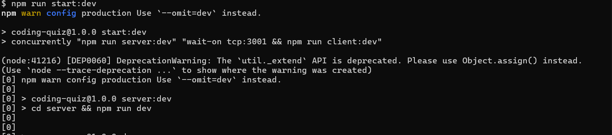
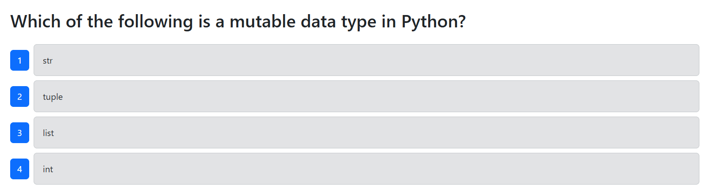
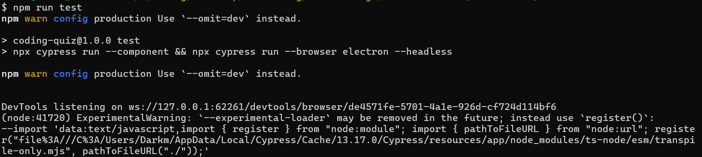

# README
  ;

  ## Description

  A test suite for verifying the functionalty of a simple tech quize web app.

  ## Table of Contents

  - [Installation](#installation})
  - [Usage](#usage)
  - [License](#license)
  - [Contributing](#contributing)
  - [tests](#tests)
  - [Questions](#questions)

  ## Installation

  N/A

  ## Usage
  Start by navigating to the folder containing the project files. Install dependencies, build the app services using npm run build, seed the database using npm run seed, and start the developer environment using npm run start:dev.

  

  When successfully connected you should be automatically directed to the app landing page. You may confirm the functionality by clicking the show start button and beginning the quiz.

  
  
  
  Then, in a second terminal navigate to the app folder. You may then run unit and end to end testing in electron or your browser of choice using npm run cypress, or in the terminal using npm run test.

  

  For more detailed instructions please refer to the linked demonstration video.

  [Demonstration](https://drive.google.com/file/d/1PQNaPevXNbSpZ-BSl5PGSR_FJpgjQjOt/view?usp=sharing)

  ## Apache 2.0 License

  Copyright 2025 Jacob Peterson

        Licensed under the Apache License, Version 2.0 (the "License");
        you may not use this file except in compliance with the License.
        You may obtain a copy of the License at

        http://www.apache.org/licenses/LICENSE-2.0

        Unless required by applicable law or agreed to in writing, software
        distributed under the License is distributed on an "AS IS" BASIS,
        WITHOUT WARRANTIES OR CONDITIONS OF ANY KIND, either express or implied.
        See the License for the specific language governing permissions and
        limitations under the License.

  https://www.apache.org/licenses/LICENSE-2.0

  ## Contributing

  N/A

  ## Tests

  N/A

  ## Questions

  For questions please contact us at https://github.com/Jpeterson1118 or at peterson.jacob13@protonmail.com.

